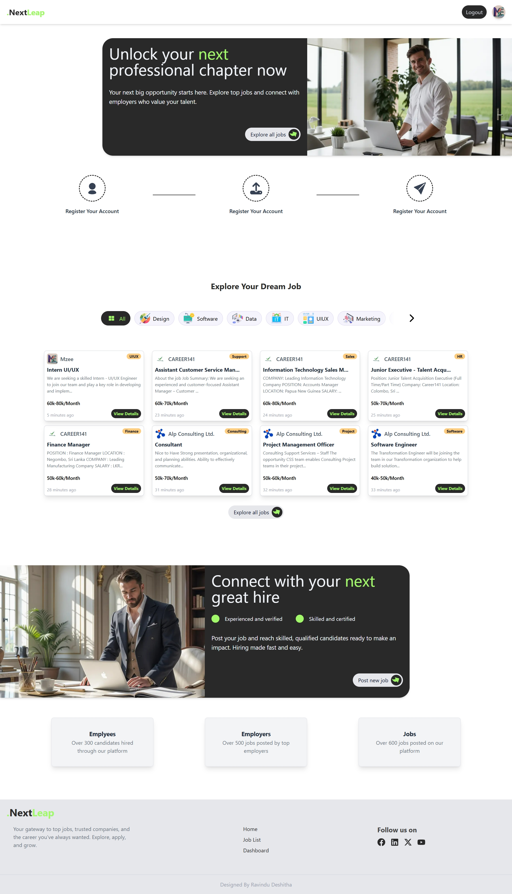
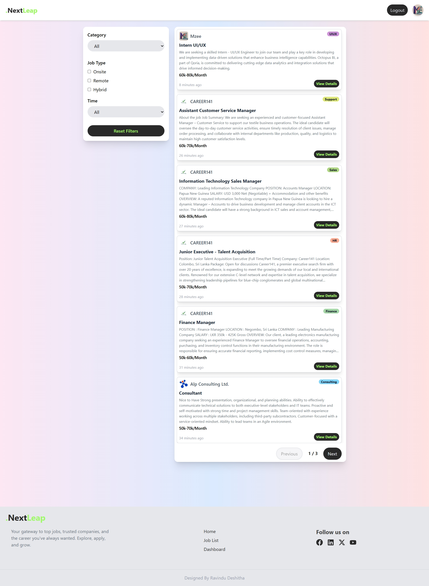
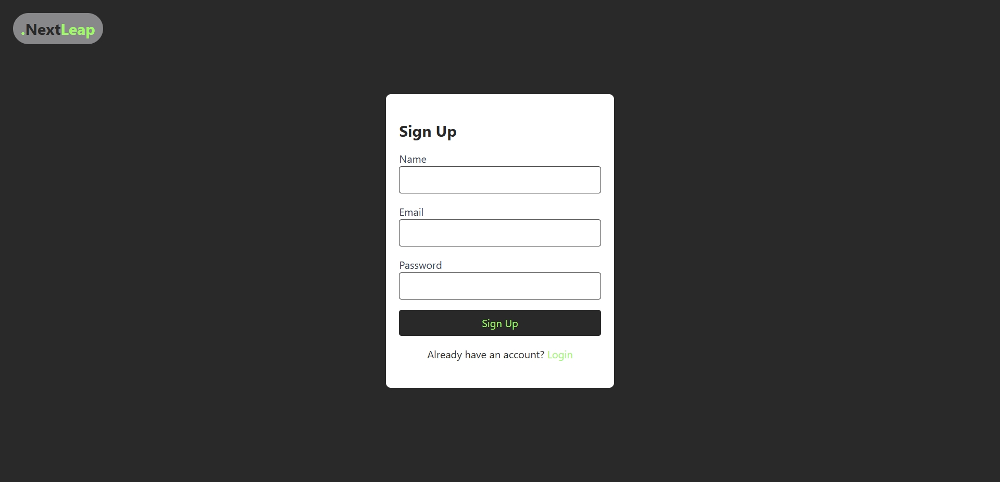
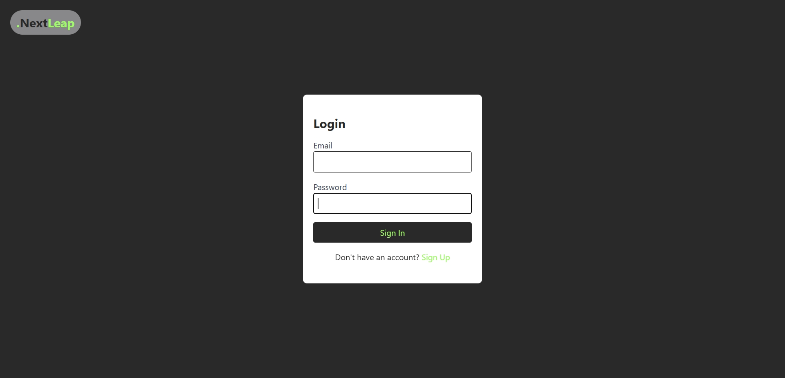
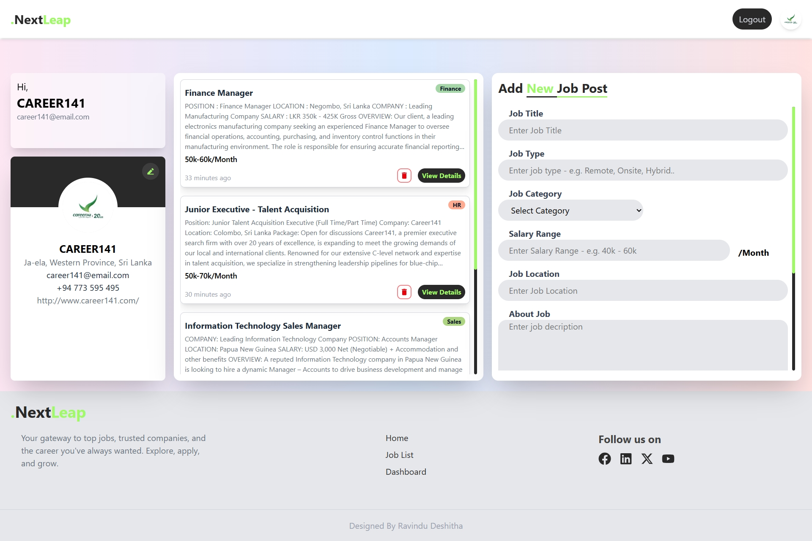
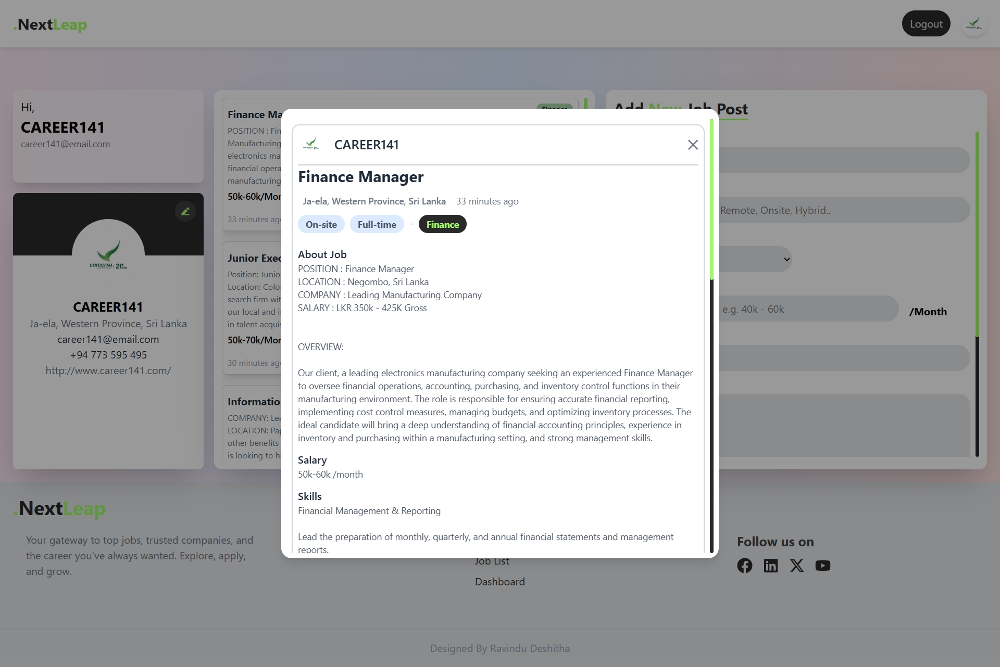
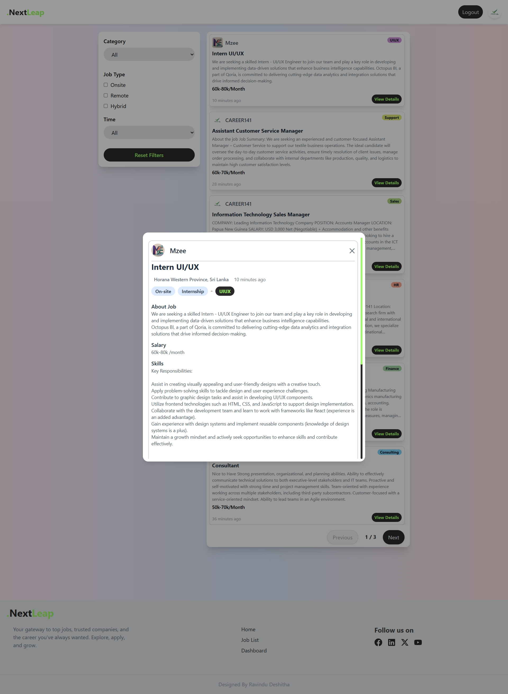

# Job Listing Portal


## 🚀 About the Project

This is a feature-rich **Job Listing Portal** built with **Next.js**, **PostgreSQL**, and **Prisma**. It serves as a modern recruitment platform where companies can post jobs and job seekers can explore opportunities with ease.

Key highlights:

- Responsive design with modern UI/UX
- Secure authentication for companies
- Easy-to-use job listing and filtering for users
- Dashboard for managing job posts
- Modular and scalable architecture

---

## 🛠️ Built With

- **Next.js** – React framework for production
- **PostgreSQL** – Powerful, open source relational database
- **Prisma** – Modern ORM for Node.js and TypeScript
- **Tailwind CSS** – Utility-first CSS framework for styling

---

## 🌟 Features

- 🌐 **Landing Page** – Highlights portal features and call-to-action buttons  
  

- 📃 **Job Listing Page** – Explore all job posts with advanced category-based filtering  
  

- 📝 **Register / Sign Up** – Secure registration for companies  
  

- 🔐 **Login** – Companies can securely log in to manage postings  
  

- 📊 **Dashboard** – Companies can view, add, and delete their job posts  
  

- ➕ **Post a Job** – Simple popup modals to create and manage job posts  
    
  

---


---

## 🧰 Getting Started

### Prerequisites
- Node.js >= 16
- npm or Yarn
- PostgreSQL

### Installation
```bash
git clone https://github.com/Ravindudeshitha/Mini-Job-Board.git
cd mini-job-board
npm install
```


### Migrate Database
```bash
npx prisma migrate dev --name init
```

### Run the App
```bash
npm run dev

```

Visit: [http://localhost:3000](http://localhost:3000)

---

## 👥 Usage Guide

1. **Landing Page** – View project introduction.
2. **Sign Up / Login** – Companies create accounts and sign in.
3. **Dashboard** – Add, manage, and delete job posts.
4. **Job Listings** – Public view with smart filtering.
5. **Job Details** – Full job descriptions available.

---

## 🤝 Contributing

Feel free to fork and improve! Open a pull request or submit issues for feature suggestions.

---

## 📄 License

This project is licensed under the MIT License. See the [LICENSE](./LICENSE) file for details.

---

## 📬 Contact

**Your Name**  – ravindudeshitha01@gmail.com

Project Link: [https://github.com/Ravindudeshitha/Mini-Job-Board](https://github.com/Ravindudeshitha/Mini-Job-Board)

